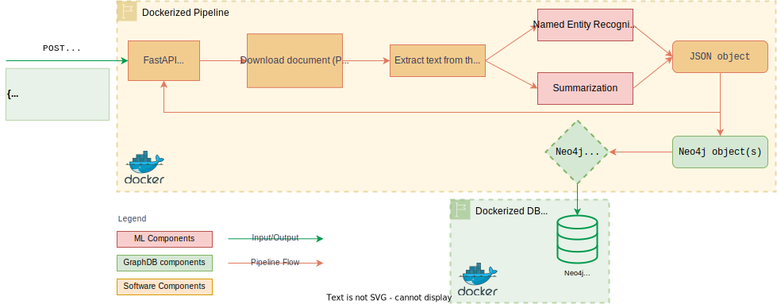

# Machine Learning pipeline for the United Nations Digital Library 🇺🇳

   

- [Machine Learning pipeline for the United Nations Digital Library 🇺🇳](#machine-learning-pipeline-for-the-united-nations-digital-library-)
  - [Pipeline description](#pipeline-description)
  - [Summarization models](#summarization-models)
  - [NER models](#ner-models)
  - [Usage](#usage)

## Pipeline description

## Summarization models

|      Model       |                                File                                |                        Paper                         |     Authors     | Year |                              HuggingFace 🤗 model                               |
| :--------------: | :----------------------------------------------------------------: | :--------------------------------------------------: | :-------------: | :--: | :-----------------------------------------------------------------------------: |
| DistillBART-CNN  |   [`DistillBARTCNN.py`](unml/models/summarize/DistilBARTCNN.py)    | [`arXiv` link](https://arxiv.org/pdf/2010.13002.pdf) | Shleifer et al. | 2020 |          [Link](https://huggingface.co/sshleifer/distilbart-cnn-12-6)           |
| DistillBART-XSUM |  [`DistillBARTXSUM.py`](unml/models/summarize/DistilBARTXSUM.py)   | [`arXiv` link](https://arxiv.org/pdf/2010.13002.pdf) | Shleifer et al. | 2020 |          [Link](https://huggingface.co/sshleifer/distilbart-xsum-12-1)          |
| DistilPegasusCNN | [`DistilPegasusCNN.py`](unml/models/summarize/DistilPegasusCNN.py) | [`arXiv` link](https://arxiv.org/pdf/2010.13002.pdf) | Shleifer et al. | 2020 |        [Link](https://huggingface.co/sshleifer/distill-pegasus-cnn-16-4)        |
|    Longformer    |              [`LED.py`](unml/models/summarize/LED.py)              |   [`arXiv` link](https://arxiv.org/pdf/2004.05150)   | Beltagy et al.  | 2020 |          [Link](https://huggingface.co/pszemraj/led-base-book-summary)          |
|      LongT5      |           [`LongT5.py`](unml/models/summarize/LongT5.py)           |   [`arXiv` link](https://arxiv.org/pdf/2112.07916)   |   Guo et al.    | 2022 | [Link](https://huggingface.co/pszemraj/long-t5-tglobal-base-16384-book-summary) |

## NER models

|  Model   |                    File                    |                        Paper                         |   Authors    | Year |                          HuggingFace 🤗 model                           |
| :------: | :----------------------------------------: | :--------------------------------------------------: | :----------: | :--: | :---------------------------------------------------------------------: |
| RoBERTa  | [`RoBERTa.py`](unml/models/ner/RoBERTa.py) | [`arXiv` link](https://arxiv.org/pdf/1907.11692.pdf) |  Liu et al.  | 2019 |             [Link](Jean-Baptiste/roberta-large-ner-english)             |
|  FLERT   |   [`FLERT.py`](unml/models/ner/FLERT.py)   | [`arXiv` link](https://arxiv.org/pdf/2011.06993.pdf) | Akbik et al. | 2020 |          [Link](https://huggingface.co/flair/ner-english-fast)          |
| spaCyNER |   [`spaCy.py`](unml/models/ner/spaCy.py)   |                          -                           |    spaCy     | 2023 | [Link (on `spaCy` website)](https://spacy.io/models/en#en_core_web_trf) |

## Usage

**TODO**
